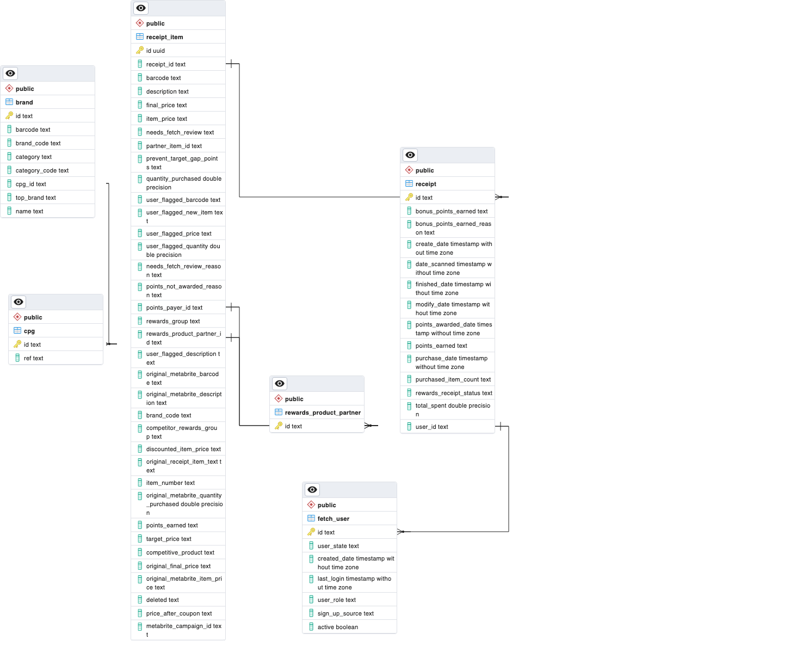

# Fetch Rewards Coding Exercise - Analytics Engineer

## Introduction
For this project I created a Postgres database and used Python (Pandas) to complete this exercise.

In order to run this program you will need to first have Python 3.9

You should then 
- run `pip -r requirements` to install necessary requirements
- add .env file in the project's root directory with correct configuration (will need to reach out to be for connection info)
- run `python main.py` from the project's root directory

## First: Review Existing Unstructured Data and Diagram a New Structured Relational Data Model
To review this data, I used [main.py](main.py) to transform and load the database into my database.

My ERG diagram is below.

This database is optimized for OLTP (Online transaction processing). 

You can view my Create Table scripts with indexes and constraints [here](files/fetch_createtables.sql)
I was unable to put foreign key constraints _everywhere_ I felt it was necessary due to issues in the
data that I mention in [the Data Quality Analysis file](data_quality_analysis.pdf).

## Second: Write queries that directly answer predetermined questions from a business stakeholder
Click [here](stakeholder_queries.md) to view the stakeholder queries

## Third: Evaluate Data Quality Issues in the Data Provided
Click [here](data_quality_analysis.pdf) to view the data quality analysis file
## Fourth: Communicate with Stakeholders
Click [here](Email_To_Stakeholders.pdf) to view the communication with Stakeholders.