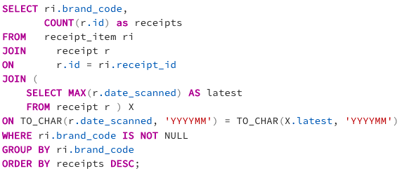
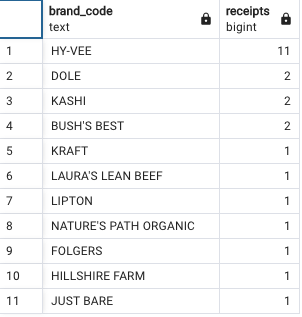
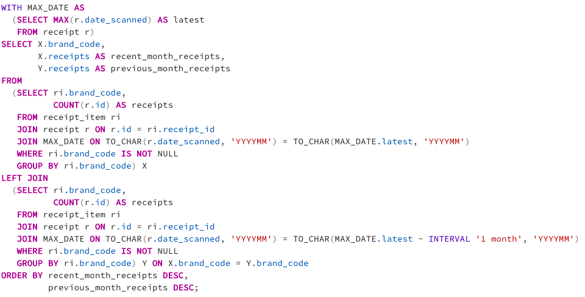
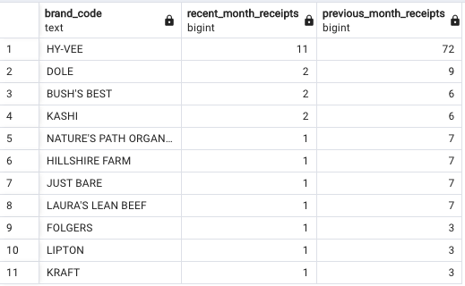
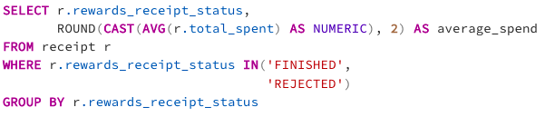
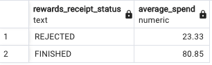

# Queries that directly answer predetermined questions from a business stakeholder

## Question 1: What are the top 5 brands by receipts scanned for most recent month?

**Query:**

**Results:**

## Question 2: How does the ranking of the top 5 brands by receipts scanned for the recent month compare to the ranking for the previous month?

**Query:**

**Results:**

## Question 3: When considering average spend from receipts with 'rewardsReceiptStatus’ of ‘Accepted’ or ‘Rejected’, which is greater?

_Modification: There was no status of 'Accepted' in the database. I've replaced 'Accepted' with 'FINISHED' to show an example of this in this query_

**Query:**

**Results:**

